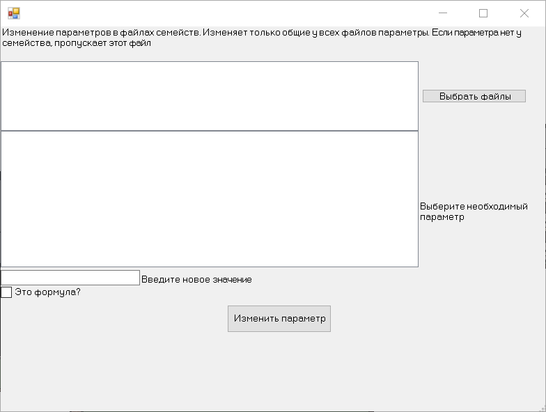

# Revit_API_Edit_Family_Parameters

Плагин для изменения параметров в файлах семейств Revit.
Изменяет только общие у нескольких файлов параметры.
Если у файла не будет соответствующего параметра, то этот файл будет пропущен.
Пока что меняет только параметры со значением String

